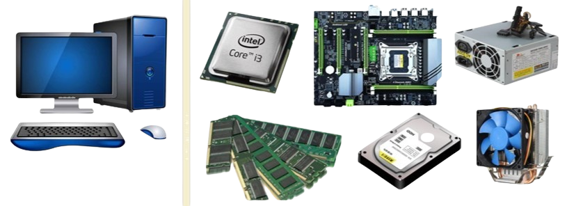
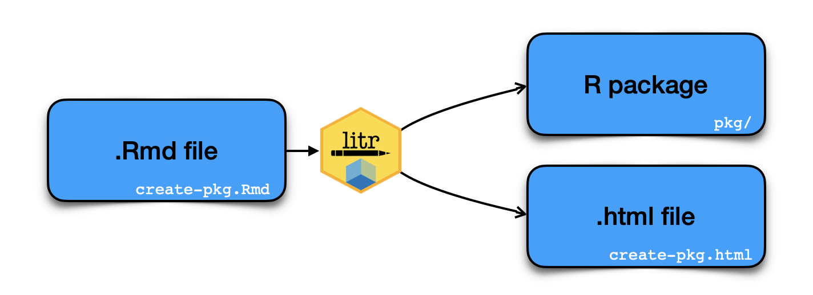

# BioinfoZero2Hero: The ABCs of Bioinformatics for starters and New Lab Members

***BioinfoZero2Hero*** is an onboarding knowledgebase designed to help starter of bioinformatics build essential skills, understand common workflows, and quickly integrate into ongoing research projects.

 

This is the ***Cover Page*** of this course (drawn by *Dr*. Zhang)

## 👩‍🏫👨‍🏫 Authors and maintainers 

Yujuan Zhang1,†

1) College of Life Sciences, Chongqing Normal University, Chongqing 401331, China

- †	Correspondence: yujuan.zhang418@gmail.com

## **BioinfoZero2Hero**: 

**Note**: Here we will provide a basic course for learning bioinformatics, which includes several modules: 

| No. | Module & Course | URL | Resource | Time | Contact |
| :----: | :---- | :----: | :----: | :----: | :----: |
| windows软件系列 |
| 01 | EndNote简明使用教程 |  |  | Jan. 20th, 2026 | Yujuan Zhang |
| 02 | 全方位文献检索与追踪 |  |  | Jan. 28th, 2026 | Yujuan Zhang |
| 03 | 手把手教你使用Google Scholar |  |  | Jan. 20th, 2026 | Yujuan Zhang |
| 04 | Mega系统发育分析 |  |  | Jan. 20th, 2026 | Yujuan Zhang |
| 计算机服务器系列 |
| 1 | 计算机系列-计算机硬件入门 |  |  | Jan. 20th, 2026 | Yujuan Zhang |
| 2 | Linux零基础入门教程 |  |  | Jan. 20th, 2026 | Yujuan Zhang |
| 3 | Shell入门教程 |  |  | Jan. 20th, 2026 | Yujuan Zhang |
| 4 | 服务器系列-SSH命令使用教程 |  |  | Jan. 20th, 2026 | Yujuan Zhang |
| 5 | 服务器系列-FTP工具使用教程 |  |  | Jan. 20th, 2026 | Yujuan Zhang |
| 编程语言系列 |
| 1 | 编程语言系列-R语言编程入门 |  |  | Jan. 20th, 2026 | Yujuan Zhang |
| 2 | R语言系列-shiny使用教程 |  |  | Jan. 20th, 2026 | Yujuan Zhang |
| 3 | R语言系列-R语言数据包的制作 |  |  | Jan. 20th, 2026 | Yujuan Zhang |
| 4 | 编程语言系列-Python编程入门 |  |  | Jan. 20th, 2026 | Yujuan Zhang |
| 5 | 编程语言系列-Python（动画版） |  |  | Jan. 20th, 2026 | Yujuan Zhang |
| 机器学习系列: From zero to hero|
| 1 | Python for Data Science |  |  | Jan. 20th, 2026 | Yujuan Zhang |
| 2 | Pandas: Handling Tables in Python |  |  | Jan. 20th, 2026 | Yujuan Zhang |
| 3 | Numpy: Powerful Numerical Computaitons |  |  | Jan. 20th, 2026 | Yujuan Zhang |
| 4 | Matplotlib: Data Visulization in Python |  |  | Jan. 20th, 2026 | Yujuan Zhang |
| 5 | Scikit-learn: Machine Learning Library for Python |  |  | Jan. 20th, 2026 | Yujuan Zhang |
| 6 | PyTorch: Getting Started with Deep Learning |  |  | Jan. 20th, 2026 | Yujuan Zhang |
| 7 | Github多人协作开发项目的教程 |  |  | Jan. 20th, 2026 | Yujuan Zhang |
| 8 | Docker快速上手教程 |  |  | Jan. 28th, 2026 | Yujuan Zhang |
| 9 | Datacamp: Learn data and AI |  |  | Jan. 20th, 2026 | Yujuan Zhang |
| 10 | Kaggle: Your Machine Learning and Data Science Community |  |  | Jan. 20th, 2026 | Yujuan Zhang |