```mermaid
flowchart TB
    subgraph Main["🧬 BioinfoZero2Hero"]
        direction TB
        Center["The ABCs of Bioinformatics<br/>for Starters & New Lab Members"]
    end

    subgraph M1["📦 Windows Software Series"]
        direction LR
        W1["EndNote"]
        W2["Literature Search"]
        W3["Google Scholar"]
        W4["MEGA Phylogenetics"]
    end

    subgraph M2["🖥️ Computer & Server Series"]
        direction LR
        C1["Computer Hardware"]
        C2["Linux Basics"]
        C3["Shell Scripting"]
        C4["SSH & FTP"]
    end

    subgraph M3["💻 Programming Languages Series"]
        direction LR
        P1["R Programming"]
        P2["R Shiny"]
        P3["R Packages"]
        P4["Python Basics"]
    end

    subgraph M4["🤖 Machine Learning Series"]
        direction LR
        ML1["Python for DS"]
        ML2["Pandas & Numpy"]
        ML3["Matplotlib"]
        ML4["Scikit-learn"]
        ML5["PyTorch"]
    end

    Center --> M1
    Center --> M2
    Center --> M3
    Center --> M4

    style Main fill:#e1f5fe,stroke:#01579b,stroke-width:2px
    style M1 fill:#fff3e0,stroke:#e65100,stroke-width:2px
    style M2 fill:#e8f5e9,stroke:#2e7d32,stroke-width:2px
    style M3 fill:#f3e5f5,stroke:#7b1fa2,stroke-width:2px
    style M4 fill:#fce4ec,stroke:#c2185b,stroke-width:2px
```

## How to Generate the Image

You can generate this diagram using one of these methods:

### Option 1: Mermaid Live Editor (Recommended)
1. Go to [https://mermaid.live](https://mermaid.live)
2. Copy the code above (without the triple backticks)
3. Paste it into the editor
4. Download as PNG or SVG

### Option 2: GitHub
- GitHub automatically renders Mermaid diagrams in markdown files
- Simply include this code block in your README.md

### Option 3: VS Code Extension
- Install "Markdown Preview Mermaid Support" extension
- Preview this file to see the rendered diagram
